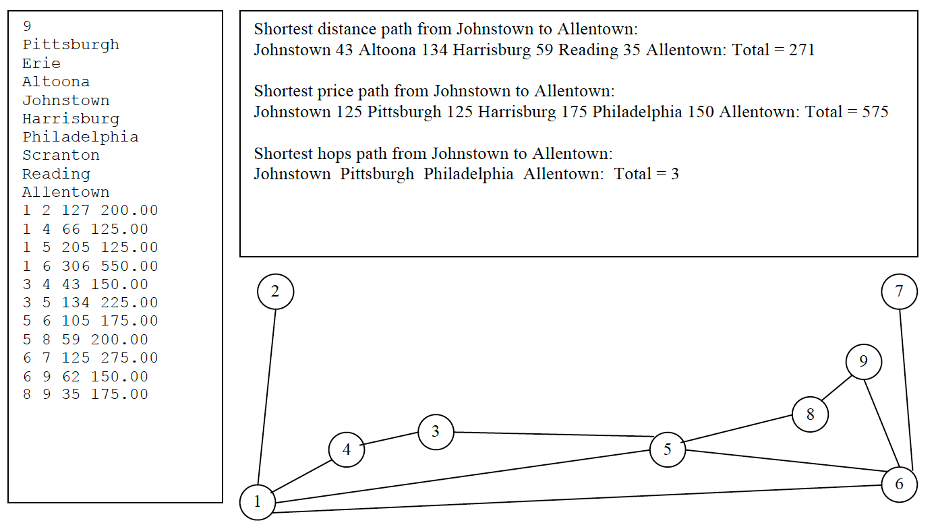
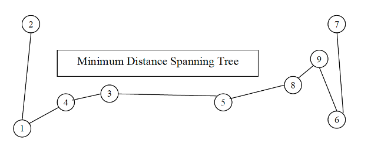

# CS 1501 – Algorithm Implementation – Assignment #4

_(Assignment adapted from Dr. John Ramirez’s CS 1501 class.)_

Due: Monday April 19th @ 11:59pm on Gradescope

Late submission deadline: Wednesday April 21st @11:59pm with 10% penalty per late day

## OVERVIEW
 
Purpose: The purpose of this assignment is to make you practice implementing some simple graph
algorithms and to see how they can be used in a somewhat practical way.

## PROCEDURE

You are to implement a simple information program for a fictional airline. Your program should be designed to be accessed by employees of the company, who may pass some of the information on to customers when needed. Details of the assignment follow below.

Initially, you need to load from a file (whose name is input by the user) a list of all of the service routes that your airline runs. These routes include the cities served and the various non-stop destinations from each city. Clearly, you will be interpreting these routes as a graph with the cities being the vertices and the non-stop trips being the edges. To keep things simple, assume that all routes are bidirectional, so that you can use an undirected graph (this is not necessarily an incorrect assumption, as airlines most often fly non-stop routes in both directions). Alternatively, you could use a directed graph, with a link in each direction for each trip. You can think of these as the current active routes, which would be updated periodically by some other program (in case a route is cancelled or perhaps snow closes an airport somewhere). The routes (edges) should have 2 different weights: one weight based on the **distance** between the cities and the other based on the **price** of a ticket between the cities.

.	Your program should be able to handle the following queries:
1.	Show the entire list of direct routes, distances and prices. This amounts to outputting the entire graph (you do not need to use graphics) in a well-formatted way. Note that this operation does not require any sophisticated algorithms to implement.
2.	Display (not necessary to use graphics -- points and edges are ok) a minimum spanning tree for the service routes based on distances. This could be useful for maintenance routes and/or shipping supplies from a central supply location to all of the airports. If the route graph is not connected, this query should identify and show each of the connected subtrees of the graph.
3.	Allow for each of the three "shortest path" searches below. For each search, the user should be allowed to enter the source and destination cites (names, not numbers) and the output should be the cities in the path (starting at the source and ending at the destination), the "cost" of each link in the path and the overall "cost" of the entire trip. If multiple paths "tie" for the shortest, you only need to print one out (see extra credit options). If there is no path between the source and destination, the program should indicate that fact.

    a.	Shortest path based on total miles (one way) from the source to the destination. Assuming distance and time are directly related, this could be useful to passengers who are in a hurry. It would also appeal to passengers who want to limit their carbon footprints.
    
    b.	Shortest path based on price from the source to the destination. This option is a bit naïve, since prices are not necessarily additive for hops on a multi-city flight. However, to keep the algorithm fairly simple, you should assume the prices ARE additive. Since distance and price do NOT always correspond, this could be useful to passengers who want to save money.
    
    c.	Shortest path based on number of hops (individual segments) from the source to the destination. This option could be useful to passengers who prefer fewer segments for one reason or other (ex: traveling with small children).
    
4.	Given a dollar amount entered by the user, print out all trips whose cost is less than or equal to that amount. In this case, a trip can contain an arbitrary number of hops (but it should not repeat any cities – i.e., it cannot contain a cycle). This feature would be useful for the airline to print out weekly "super saver" fare advertisements or to help travelers who are flexible in their destinations but not flexible in their overall costs. Be careful to implement this option as efficiently as possible, since it has the possibility of having an exponential run-time (especially for long paths). Consider a recursive / backtracking / pruning approach.

5.	Add a new route to the schedule. Assume that both cities already exist, and the user enters the vertices, distance, and price for the new route. Clearly, adding a new route to the schedule may affect the searches and algorithms indicated above.

6.	Remove a route from the schedule. The user enters the vertices defining the route. As with 5), this may affect the searches and algorithms indicated above.

7.	Quit the program. Before quitting, your routes should be saved back to the file (the same file and format that they were read in from but containing the possibly modified route information).

.	You must encapsulate the functionality of your airline in a **single, cohesive class** named `AirlineSystem.java`. You must represent the graph as an **adjacency list**. The cities should minimally have a string for a name and any other information you want to add. The data should be input from a file when the program begins. The edges will have multiple values (distance, price) and can be implemented as either a single list of edges with two values each, or as two separate lists of edges, one for each value. You may use the author’s various graph classes as a starting point.

.	You must use the algorithms and implementations discussed in class for your queries. For example, to obtain the MST you must use either **Prim’s or Kruskal’s algorithm** and for the shortest distance and shortest price paths you must use **Dijkstra’s algorithm**. To obtain the shortest hops path you must use **breadth-first search**. _Clearly, since the algorithms are encapsulated in classes in the author’s examples, you will need to extract and modify these in order to incorporate them as methods within your class_.

. Your main program must have a menu-driven loop that asks the user for any of the choices above. Your output should be clear and well-formatted.

.	Below is an example input file, visual graph, and response to some of the queries listed above. The index numbers for the vertices are based on the order that the cities appear in the file (note that the indexing starts at 1). Look in the repository for an additional test file and more complete sample output.

## EXTRA CREDIT

If you want to try some extra credit, here are some ideas:

.	(10 points) Add a query to indicate the shortest route (or cheapest route) from a source city to a destination
city through a third city. In other words, "What is the shortest path from A to B given that I
want to stop at C for a while?" All three cities should be input by the user.
.	(6 points) For the "minimum" queries above, in the event of a "tie", show all results. If you do this option,
you must submit a test file that demonstrates that it works correctly.
.	(4 points) Allow vertices to be added or removed from your graph (handling corresponding edges
correctly).
.	(6 points) Add graphics to improve your output.

## SUBMISSION REQUIREMENTS

You must submit to Gradescope at least the following two files:
1.	`AirlineSystem.java`
2.	The Assignment Information Sheet

The idea from your submission is that your TA can compile and run your programs from the command line WITHOUT ANY additional files or changes, so be sure to test it thoroughly before submitting it. If the TA cannot compile or run your submitted code it will be graded as if the program does not work.

If you cannot get the programs working as given, clearly indicate any changes you made and clearly indicate why on your Assignment Information Sheet.  You will lose some credit for not getting it to work properly, but getting the main programs to work with modifications is better than not getting them to work at all.  A template for the Assignment Information Sheet can be found in the assignment’s Canvas folder. You do not have to use this template but your sheet should contain the same information.  
Note: If you use an IDE such as NetBeans, Eclipse, or IntelliJ, to develop your programs, make sure they will compile and run on the command line before submitting – this may require some modifications to your program (such as removing some package information). 

## RUBRICS

Item|Points
----|------|
Graph structure + data|	8
Data input / output using file correctly|	6
Main menu / driver is well done|	8
Output formatted nicely|	8
List of routes / distances / prices|	6
Minimum spanning tree|	8
Shortest path distance|	8
Shortest path cost|	8
Shortest path hops|	8
All trips ≤ $ amount|	14
Add / remove edges|	10
Documentation|	4
Assignment Information Sheet/Submission|	4
Extra Credit|	Maxmimum of 10 points

